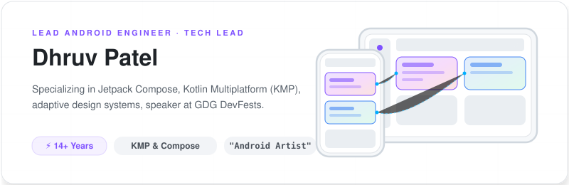
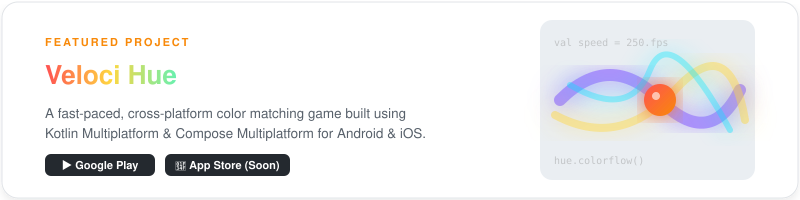
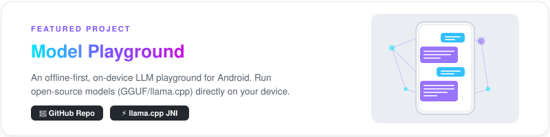

# Dhruv Patel · `@DearDhruv`

  

  
  
  
  

Lead Android Engineer with **14+ years** of experience building scalable Android applications, leading teams, and delivering performant, user-centric products across global markets. Specialized in **Kotlin**, **Jetpack Compose**, **adaptive layouts**, and modern Android architecture - with strong experience in **hardware integrations**, **multimedia editing workflows**, and **technical speaking** at developer conferences.

  

## 🧰 Tech Stack

**Languages**  
 

**Android & UI**  
   

**Multiplatform**  
 

**Media & Hardware**  
  

**Data & APIs**  
  

**Async, DI & Build**  
 

**Architecture**  
Clean Architecture · MVVM · MVI · Modularization

  

## 🚀 Featured Projects

  

  

  

## 🎤 Speaking · GDG DevFests & Workshops

| Year | Talk | Where |
|---|---|---|
| **Dec 2025** | Jetpack Compose - Game-changing features (Navigation 3, Adaptive, Performance, Accessibility) | Surat 🇮🇳 |
| **Nov 2025** | Android 17 Mandates - Adaptive Layouts across all form factors | Ahmedabad 🇮🇳 |
| **Jun 2022** | What's New in Android 13 | Gandhinagar 🇮🇳 |
| **Sep 2019** | UI & UX with Ease for Mobile | Surat & Rajkot 🇮🇳 |
| **Sep 2018** | Android Jetpack - Slices | Ahmedabad 🇮🇳 |
| **Feb 2018** | DialogFlow - Chatbot Creation Workshop | Anand & Rajkot 🇮🇳 |

  

## 📊 GitHub at a Glance

  

  

  
  
  

  

## 🤝 Let's Build Something

- 💼 **Freelance / Contract** - Open for interesting Android, KMP, or CMP projects. Reach out via [email](mailto:dhruv.time@gmail.com).
- 💬 **Ask me anything** - Android architecture, Kotlin, Compose, KMP/CMP, hardware integration, multimedia, or tech leadership - find me on [X](https://x.com/DearDhruv) or [LinkedIn](https://linkedin.com/in/DearDhruv).
- 🎤 **Invite me to speak** - Happy to talk at meetups and DevFests on Compose, adaptive layouts, and modern Android.

  

## 🌌 Off the Clock

  🪐 <b>Astronomy</b> &nbsp;·&nbsp; 🎌 <b>Anime</b> &nbsp;·&nbsp; ♟️ <b>Chess</b>

  

  <i>"Android Artist"</i>

